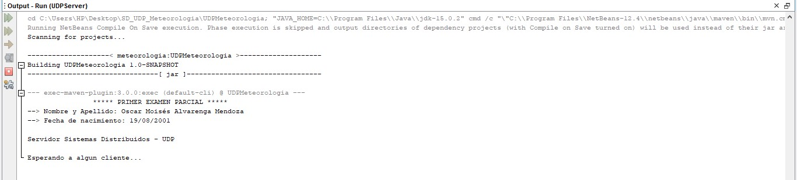
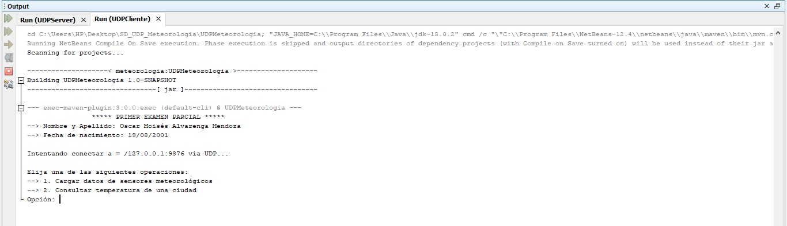
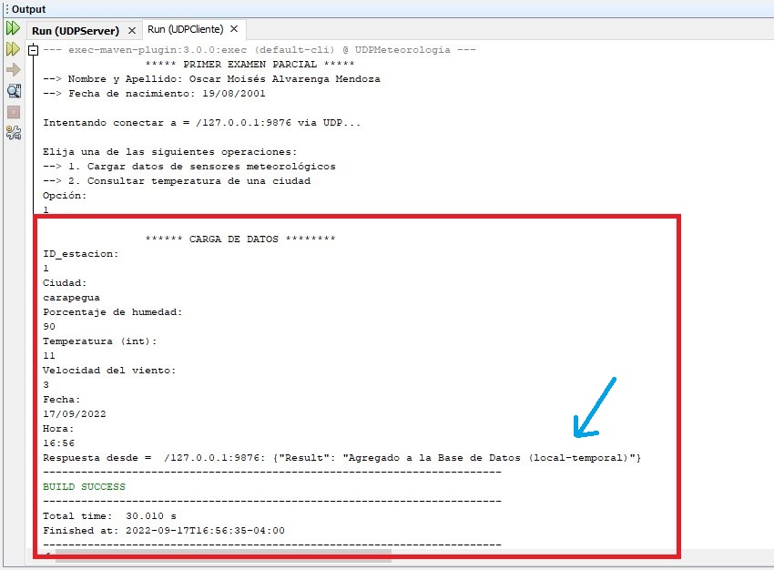
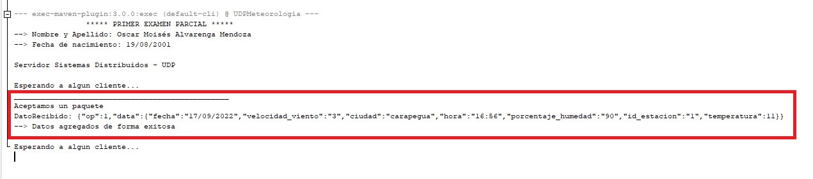
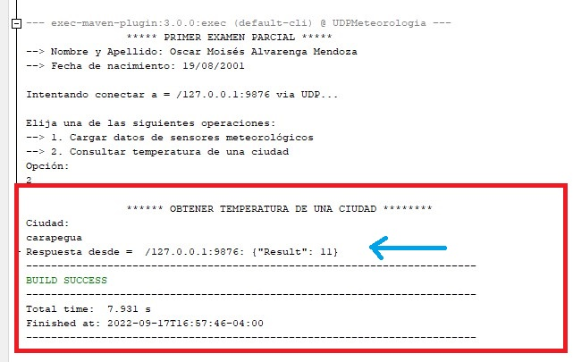
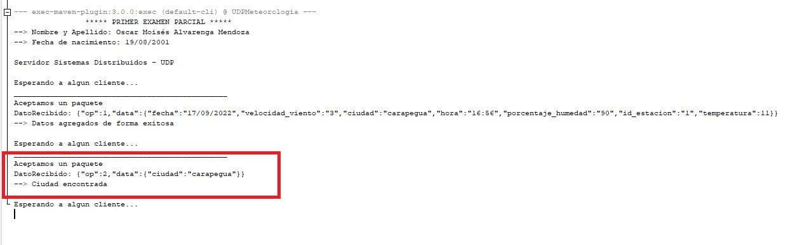

<!-- Cabecera principal -->
<div align="center">
  <a href="https://github.com/othneildrew/Best-README-Template">
    
  </a>

  <h3 align="center">UDP Meteorologia - Documentación</h3>
</div>


  

-----------------------------------------------------------------------   
<!-- Cabecera del indice -->
<div id="top"></div>  

## Indice
<ul>
    <li><a href="#instalación">Instalación</a></li>
    <li><a href="#screenshots">Screenshots</a></li>
    <li><a href="#tecnologias-utilizadas">Tecnologias y Herramientas Utilizadas</a></li>
    <li><a href="#contactos">Contactos</a></li>
</ul>


-----------------------------------------------------------------------
<!-- Instalación -->
## Instalación

1. Descargar el proyecto del GitHub: 
   ```sh
   git clone https://github.com/moises35/SD_UDP_Meteorologia.git
   ```
2. Abrir el proyecto con algún IDE o editor de código de preferencia (el proyecto originalmente fue realizado en NetBeans)
3. Instalar las dependencias utilizadas en el proyecto en caso de ser necesario.
4. ¡Listo! El proyecto ya está listo para su uso


<p align="right">(<a href="#top">Volver al indice</a>)</p> 
</br>   


-----------------------------------------------------------------------
<!-- Screenshots -->
## Screenshots
1. Ejecutamos el archivo `UDPServer.java` para iniciar el servidor. Al iniciarlo automáticamente el servidor se pone en modo de escucha y espera a que un cliente se conecte.
<div align="center">
    
</div> <br /> 

2. Ejecutamos el archivo `UDPCliente.java` para poder iniciar un cliente y establecer una comunicación con el servidor. Una vez iniciado se nos presenta un menú con opciones.
<div align="center">
    
</div> <br /> <br />

3. Realizamos una carga de datos desde el cliente y al finalizar el servidor nos responde y retorna un JSON indicandonos que los datos fueron agregados de forma exitosa.
<div align="center">
    
</div> <br /> <br />

4. Por otro lado, también podemos fijarnos que en la consola del servidor se recibio una petición y se retorno una respuesta, para luego volver a esperar otro cliente.
<div align="center">
    
</div> <br /> <br />

5. Nuevamente volvemos a iniciar otro cliente, pero esta vez utilizando la segunda opción. Como podemos ver el servidor nos retorna la temperatura de dicha ciudad que le solicitamos
<div align="center">
    
</div> <br /> <br />

5. El servidor recibió el dato y seguidamente retorno lo solicitado por el cliente para volver a esperar a otro cliente.
<div align="center">
    
</div> <br /> <br />


<p align="right">(<a href="#top">Volver al indice</a>)</p> 
</br>   


-----------------------------------------------------------------------
<!-- Tecnologias utilizadas -->
## Tecnologias utilizadas


- ![Java]  
- ![Netbeans]   
- ![Git]   
- JSON


<p align="right">(<a href="#top">Volver al indice</a>)</p> 
</br>   


-----------------------------------------------------------------------
<!-- Contactos -->
## Contactos

Moisés Alvarenga - oscar-alvarenga35@fpuna.edu.py

GitHub: [https://github.com/moises35](https://github.com/moises35)


<p align="right">(<a href="#top">Volver al indice</a>)</p> 
</br>   


<!-- Links a las imagenes de los lenguajes -->
[Java]: https://img.shields.io/badge/Java-ED8B00?style=for-the-badge&logo=java&logoColor=white
[Netbeans]: https://img.shields.io/badge/apache%20netbeans-1B6AC6?style=for-the-badge&logo=apache%20netbeans%20IDE&logoColor=white
[Git]: https://img.shields.io/badge/git-%23F05033.svg?style=for-the-badge&logo=git&logoColor=white